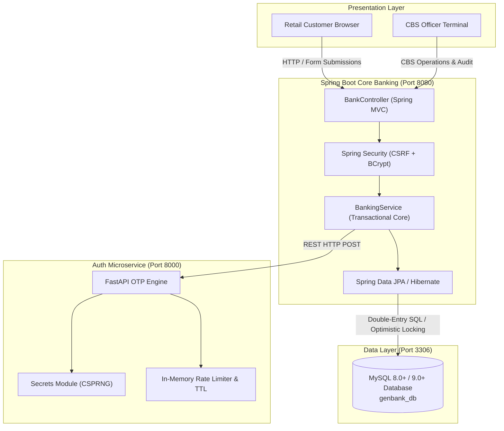

# GenBank (Apna Bank) - Digital Core Banking Platform

[](https://www.oracle.com/java/)
[](https://spring.io/projects/spring-boot)
[](https://fastapi.tiangolo.com/)
[](https://www.python.org/)
[](https://www.mysql.com/)
[](https://spring.io/projects/spring-security)
[](https://junit.org/junit5/)
[](LICENSE)

An enterprise-grade, polyglot Core Banking System (CBS) and Retail Internet Banking platform. Built with **Spring Boot 4 (Java 21)** for core financial ledger transactions and customer management, paired with a dedicated **Python FastAPI** microservice for cryptographic multi-factor authentication (OTP) and e-KYC validation.

---

## Architecture Overview



---

## Key Engineering Highlights

### 1. Double-Entry Clearing Ledger
- Every fund transfer automatically records dual immutable transactions (**DEBIT** for the remitter, **CREDIT** for the beneficiary) bound by a shared clearing reference ID (`TXN...`).
- Composite unique constraint `(reference_id, account_number)` ensures ledger balance integrity and prevents duplicate clearing execution.

### 2. Optimistic Concurrency Control (`@Version`)
- The customer balance is protected against race conditions and concurrent transfer requests ("Lost Updates") using JPA `@Version` optimistic locking.
- Prevents balance corruption when multiple asynchronous requests target the same account simultaneously.

### 3. Polyglot Microservices Integration
- **Core Platform:** Spring Boot 4 handling transaction orchestration, session security, and database persistence.
- **Authentication Service:** Python FastAPI microservice providing cryptographic OTP generation via `secrets` CSPRNG, TTL-based expiration (5 minutes), brute-force lockout (max 3 attempts), and sliding-window rate limiting.

### 4. Core Banking System (CBS) Terminal
- Real-time live clearing audit log displaying recent bank-wide clearing operations.
- Customer directory search with multi-field filtering (Name, Account Number, Email).
- Administrative account control: immediate freezing and restoring of customer accounts (`ACTIVE`, `FROZEN`, `BLOCKED`).

### 5. Indian Banking Standards Compliance
- RBI-compliant 11-character uniform Indian Financial System Code: `GBIN0GENBNK`.
- Algorithmic unique account number generation with bank prefix (`GB...`).
- Salted BCrypt password encryption (`$2a$10$...`) with automatic legacy credential upgrade on startup.

---

## Tech Stack

| Component | Technology | Description |
| :--- | :--- | :--- |
| **Backend Core** | Java 21 LTS, Spring Boot 4.1.0 | Core banking logic, MVC, REST APIs |
| **Microservice** | Python 3.12+, FastAPI, Uvicorn | Asynchronous OTP dispatch and verification |
| **Database** | MySQL 8.0+ / 9.0+ | Relational persistence with InnoDB engine |
| **ORM** | Hibernate 7, Spring Data JPA | Entity mappings, repository pattern, `@Version` locking |
| **Security** | Spring Security 6, BCrypt | Form-based auth, CSRF tokens, session migration |
| **Frontend** | Thymeleaf, HTML5, CSS3, JavaScript | Modern netbanking UI & CBS dark terminal theme |
| **Testing** | JUnit 5, Mockito | Unit tests & SpringBootTest integration tests |
| **Build Tool** | Apache Maven Wrapper (`mvnw`) | Build automation and fat JAR packaging |

---

## Project Structure

```
GenBank/
├── Auth-Service/               # Python FastAPI Microservice
│   ├── main.py                 # FastAPI OTP endpoints, rate limiter & TTL
│   ├── requirements.txt        # Python microservice dependencies
│   └── latest_otp.txt          # Local terminal OTP output log (gitignored)
├── db/
│   └── schema.sql              # MySQL DDL schema and initial seed data
├── src/
│   ├── main/
│   │   ├── java/com/genbank/apnabank/
│   │   │   ├── config/         # SecurityConfig, BankConstants, DataInitializer
│   │   │   ├── controller/     # BankController (User & CBS Admin endpoints)
│   │   │   ├── dto/            # TransferRequest
│   │   │   ├── model/          # User, Admin, Transaction, AccountStatus
│   │   │   ├── repository/     # UserRepository, AdminRepository, TransactionRepository
│   │   │   ├── service/        # BankingService (Core financial logic)
│   │   │   └── GenBankApplication.java
│   │   └── resources/
│   │       ├── application.properties
│   │       └── templates/      # Thymeleaf UI (index, user_dashboard, admin_dashboard)
│   └── test/java/com/genbank/apnabank/
│       ├── BankingServiceTests.java     # 22 Comprehensive unit tests
│       └── GenBankApplicationTests.java # Spring Boot context integration test
├── run.bat                     # 1-Click platform launcher for Windows
├── stop.bat                    # 1-Click clean shutdown script
├── pom.xml                     # Maven project definition
└── README.md
```

---

## Quickstart Guide

### Prerequisites
- **Java:** JDK 21 or higher ([Eclipse Temurin / OpenJDK](https://adoptium.net/))
- **Python:** Python 3.10+ ([python.org](https://www.python.org/)) with `pip`
- **Database:** MySQL 8.0+ or 9.0+ running on port `3306`

### 1. Database Setup
Ensure MySQL is running, then create the database and seed records using the provided script:
```bash
mysql -u root -p < db/schema.sql
```

### 2. Install Python Dependencies
```bash
cd Auth-Service
pip install -r requirements.txt
cd ..
```

### 3. Launching the Platform

#### Option A: One-Click Launcher (Windows)
Double-click [`run.bat`](run.bat) or run from your terminal:
```cmd
.\run.bat
```
*The launcher checks MySQL, starts the FastAPI microservice on port 8000, boots Spring Boot on port 8080, and automatically opens your browser to `http://localhost:8080/`.*

#### Option B: Manual Startup
1. **Start the Python OTP Microservice:**
   ```bash
   cd Auth-Service
   python main.py
   ```
2. **Start the Spring Boot Platform:**
   ```bash
   ./mvnw spring-boot:run
   ```
3. Open your browser and navigate to: `http://localhost:8080/`

---

## Demo Credentials

### 1. CBS Administrator Terminal
- **Portal Tab:** `CBS Admin`
- **Email:** `admin@genbank.com`
- **Password:** `Admin@123`

### 2. Retail Customer Accounts
| Account Holder | Account Number | Registered Email | Balance | Password |
| :--- | :--- | :--- | :--- | :--- |
| **Soham Rajkumar Patil** | `GB1893228017` | `patilsoham189@gmail.com` | ₹2,000.00 | User password |
| **Chaudappa Sidaramappa Sindagi** | `GB1269557905` | `sindagi99official@gmail.com` | ₹500.00 | User password |
| **Atharv Umesh Bhange** | `GB1235036932` | `bhangeatharv@gmail.com` | ₹1,000.00 | User password |

*To test onboarding, open the "Register Account" tab, enter applicant details, click "Send 6-Digit Verification Code", check the server terminal for the dispatched OTP, and complete registration.*

---

## Running Automated Tests

Run the full automated test suite (23 unit & integration tests):
```bash
./mvnw test
```
All tests run with zero failures and zero warnings, validating:
- Account registration with duplicate check enforcement
- BCrypt password encryption & legacy password auto-migration
- Strict email-only CBS admin authentication
- Double-entry ledger generation for fund transfers
- Frozen account transaction prevention & insufficient funds handling
- Asynchronous OTP dispatch and verification pipelines

---

## License
This project is open-source and available under the [MIT License](LICENSE).
